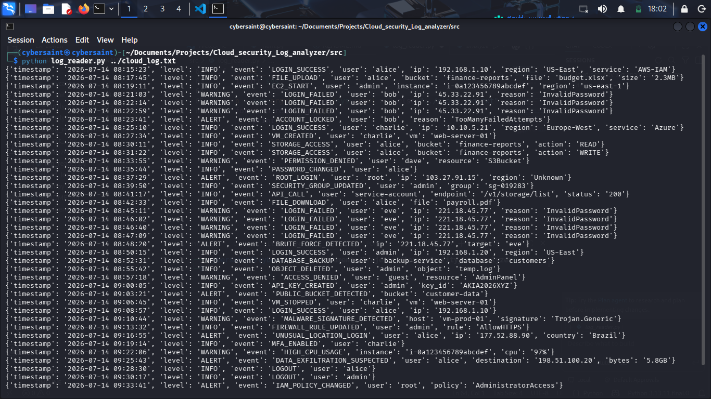
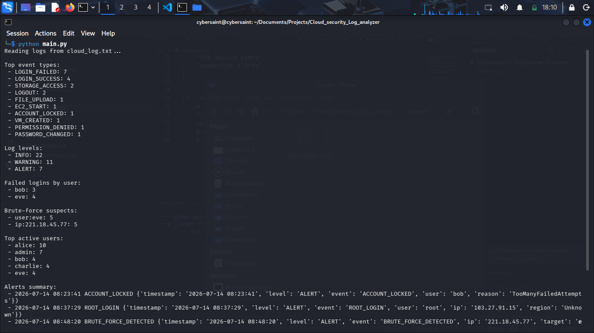

# ☁️ Cloud Security Log Analyzer

## Overview

The **Cloud Security Log Analyzer** is a beginner-friendly Python project that reads and analyzes cloud security logs from a text file. It demonstrates how security analysts can automate the process of identifying suspicious activities instead of manually reviewing log files.

The project was built to practice Python fundamentals while learning basic cloud security concepts.

---

## Features

- Read and parse cloud security logs
- Count security events
- Count log severity levels (INFO, WARNING, ALERT)
- Detect failed login attempts
- Detect possible brute-force attacks
- Identify the most active users
- Display security alerts

---

## Project Structure

```
Cloud-Security-Log-Analyzer/
│
├── cloud_log.txt
├── main.py
├── README.md
└── src/
    ├── log_reader.py
    └── log_analyzer.py
```

---

## How It Works

```
Read Log File
      ↓
Parse Each Log Entry
      ↓
Convert to Dictionary
      ↓
Analyze Events
      ↓
Display Results
```

---

## Python Concepts Used

- Functions
- Lists
- Dictionaries
- Loops
- Conditional Statements
- File Handling
- Exception Handling
- `Counter` from the `collections` module

---

## Sample Output

```text
Event Counts
-------------
LOGIN_SUCCESS : 6
LOGIN_FAILED  : 7

Level Counts
------------
INFO     : 20
WARNING  : 11
ALERT    : 9

Brute Force Suspects
--------------------
user:eve
ip:221.18.45.77
```

---

## Skills Learned

- Python Programming
- Log File Parsing
- Data Analysis
- Cloud Security Basics
- Security Automation

---
## Images




## Future Improvements

- Export reports to CSV or JSON
- Add charts and graphs
- Support AWS CloudTrail logs
- Support Azure and GCP logs
- Build a simple GUI
- Generate PDF reports

---

## License

This project is for educational purposes and beginner Python practice in cloud security.